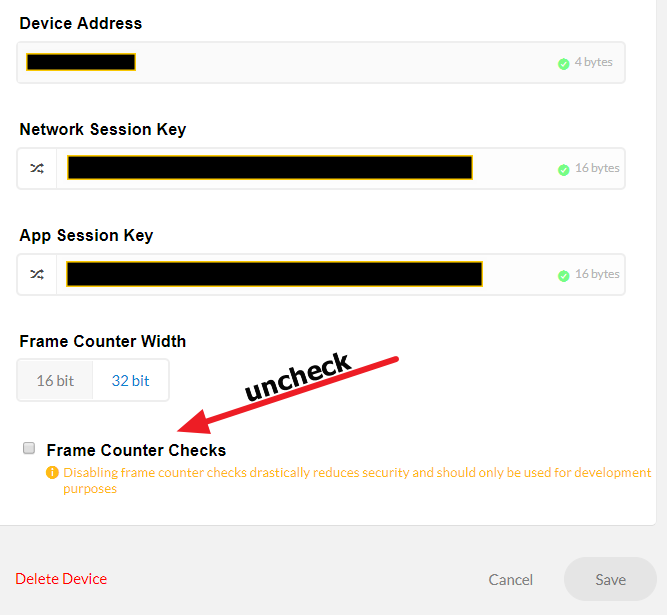

# GATEWAY
First we need to connect the gateway to WiFi, because WifiManager is not available at this time so we have to hardcode it. 
ESP32 can only connect to 2.4GHz WiFi.
After power and connect to known AP(Access Point), gateway is good to go.

# NODE
For demonstration purpose, we'll ABP(Activation by Personalization). Once again, it's not secure. 
We can improve by using OTAA(Over-the-Air Activation); however, we don't have budget for multi-channel gateway.
Remember uncheck the Frame Counter Checks so node can reconnect easily.

# APPLICATION
We use Cayenne
